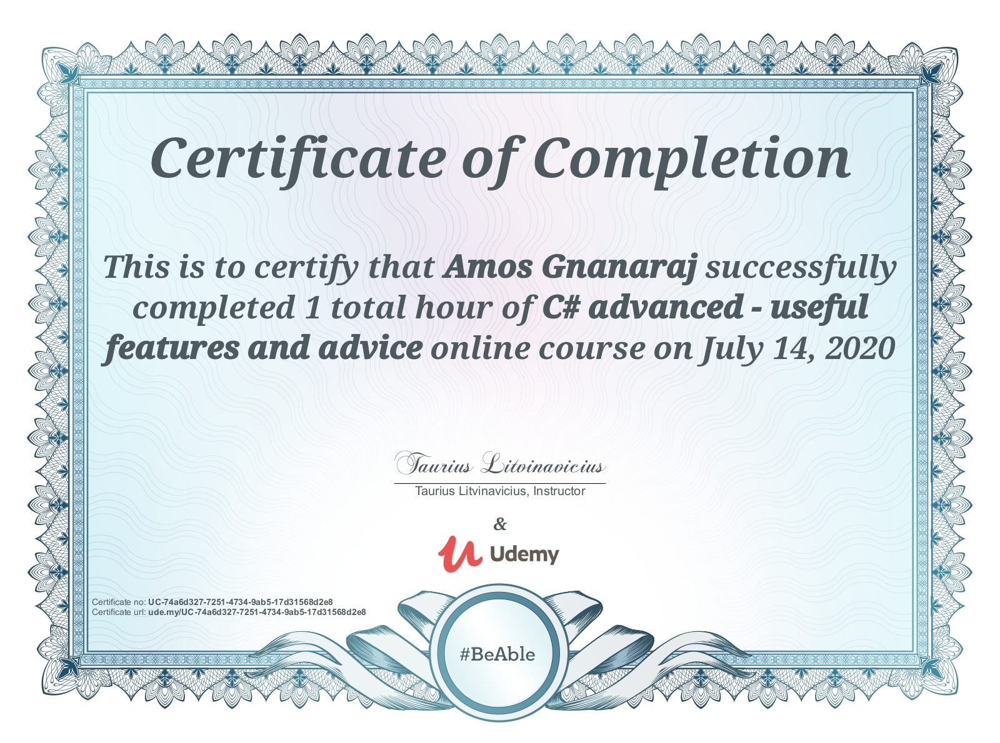
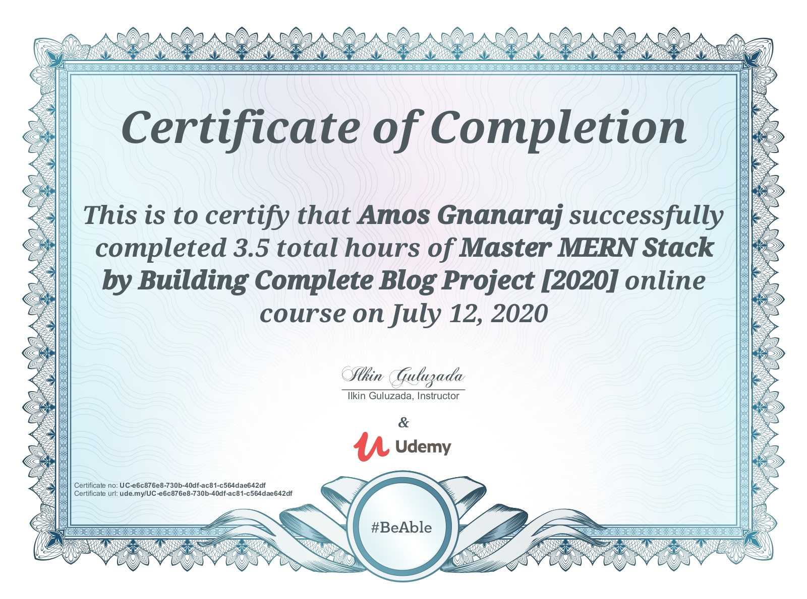
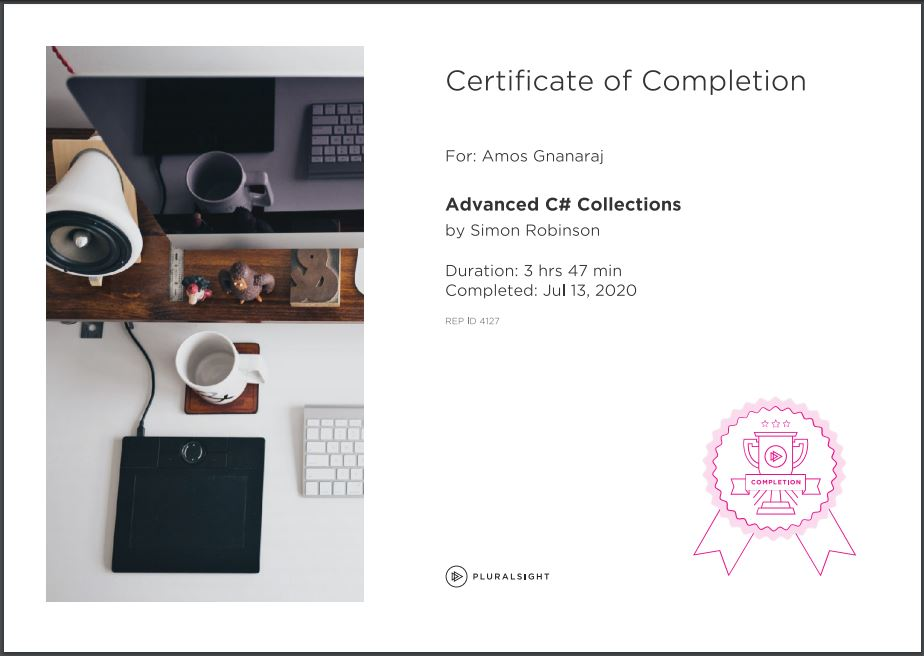

<!DOCTYPE html>
<html lang="en">

<head>
  <meta http-equiv="Content-Type" content="text/html; charset=UTF-8">
  <meta name="apple-mobile-web-app-title" content="CodePen">
  <link rel="shortcut icon" type="image/x-icon" href="./favicon.ico">
  <title>My Portfolio - Amos Gnanaraj</title>
  <meta name="viewport" content="width=device-width, initial-scale=1">
  <link rel="stylesheet" href="./src/css/style.css">
  <link rel="stylesheet" href="./src/css/material-kit.css">
  <!-- <link rel="stylesheet" href="https://cdnjs.cloudflare.com/ajax/libs/materialize/1.0.0/css/materialize.min.css"> -->
  
  
  
  <link rel="stylesheet" href="./src/css/carousel.css">
</head>

<body translate="no" class="sidebar-collapse">

  <nav class="navbar navbar-expand-lg bg-white fixed-top">
    

      <a class="navbar-brand" href="https://amosgnanaraj.github.io/">Amos Gnanaraj</a>
      <button class="navbar-toggler" type="button" data-toggle="collapse" data-target="#navbarNav"
        aria-controls="navbarNav" aria-expanded="false" aria-label="Toggle navigation">
        Toggle navigation
        
        
        
      </button>
      

        <ul class="navbar-nav ml-auto mr-0">
          <li class="nav-item">
            <a class="nav-link" href="https://www.linkedin.com/in/amosgnanaraj/" target="_blank"
              rel="noopener,nofollow">LinkedIn</a>
          </li>
          <li class="nav-item">
            <a class="nav-link" href="./assets/Resume - Amos Gnanaraj.pdf" target="_blank"
              rel="noopener,nofollow">Resume (pdf)</a>
          </li>
        </ul>
      

    

  </nav>
  

    

      

        <!-- 

          
<a class="LI-simple-link" href='https://in.linkedin.com/in/amosgnanaraj?trk=profile-badge'>Amos Gnanaraj</a>

        
 -->
        

          

            <h1>Amos Gnanaraj J</h1>
            
Full Stack Developer

          

        

        
      

    

  

  

    <h2 class="text-center">Education</h2>
    

      

        

          

            

              

                <h4 class="card-title">St. Peter's College of Engineering and Technology</h4>
              

            

            

              B.E in Computer Science and Engineering
              
GPA: 6.65Aug 2012 -
                  May 2016

            

          

        

        

          

            

              

                <h4 class="card-title">St. Joseph's Matric Hr Sec School</h4>
              

            

            

              Higher Secondary
              
Percentage: 80Aug 2010
                  -
                  May 2012

            

          

        

      

    

    

      

      <h2 class="text-center">Experience</h2>
      

        <h3>Senior Developer</h3>
        

          
Access Healthcare Services Pvt Ltd

          
June 2019 - Present

        

        

        <ul>
          <li>
            Building highly customized solutions for organization using Microsoft Technologies
          </li>
          <li>
            Building productivity tools which boosts company's revenue
          </li>
        </ul>
        

      

      

        <h3>Associate Software Engineer</h3>
        

          
Saggezza India Pvt Ltd

          
May 2016 - May 2019

        

        

        <ul>
          <li>
            Hands on in application development using with C# in MVC as the
            code-behind language and EDMX as the Database data consumer
          </li>
          <li>
            Experience in development of applications using .NET and Web technologies
            like CSS, JavaScript and HTML
          </li>
          <li>
            Knowledge in ASP.NET MVC – 5 with ORM
          </li>
          <li>
            Knowledge on Solid Principles and Object Oriented Programming
          </li>
          <li>
            Working experience in Test Driven Development(TDD)
          </li>
        </ul>
        

      

    

    

      

      <h2 class="text-center">Skills</h2>
      

        

          <h5 class="font-weight-bold">Technology</h5>
          
Microsoft SQL Server

          
ASP.NET Web API

          
JavaScript/JQuery

          
Entity Framework

          
ASP.NET MVC

          
HTML

          
CSS

        

        

          <h5 class="font-weight-bold">Other</h5>
          
Teamwork

          
Flexible

          
Adaptable

          
Communication

          
Cross-Functional Teams

        

      

    

    

      

      <h2 class="text-center">Awards &amp; Certifications</h2>
      

        

          <h5 class="font-weight-bold">Certifications</h5>
          
Certification on Dot Net Technologies by NIIT

          
Developing and Deploying Applications on Microsoft Azure by NIIT

        

        

          <h5 class="font-weight-bold">Awards</h5>
          
Nominated as Shining Star at Groove 2019

        

      

    

    <!-- 

      

        <button class="carousel__btn carousel__btn--l isHidden">
          &laquo;
        </button>
    
        

          <ul class="carousel__track">
            <li class="carousel__slide current-slide"></li>
            <li class="carousel__slide"></li>
            <li class="carousel__slide"></li>
            <li class="carousel__slide"></li>
          </ul>
        

    
        <button class="carousel__btn carousel__btn--r">
          &raquo;
        </button>
    
        

          <button class="carousel__indicator carousel__active"></button>
          <button class="carousel__indicator"></button>
          <button class="carousel__indicator"></button>
          <button class="carousel__indicator"></button>
        

      

    
 -->
    

      

      <h2 class="text-center">Contact Me Directly</h2>
      <form id="contact-form">
        

          

            <label for="input_name">Name</label>
            <input type="text" class="form-control" name="entry.1305230502" id="input_name" placeholder="Your Name"
              required="">
          

          

            <label for="input_email">Email</label>
            <input type="email" class="form-control" name="entry.522294879" id="input_email"
              placeholder="you@example.com" required="">
          

        

        

          <label for="input_subject">Subject</label>
          <input type="text" class="form-control" name="entry.395694419" id="input_subject"
            placeholder="Your Unique Subject" required="">
        

        

          <label for="input_message">Message</label>
          <textarea type="text" class="form-control" name="entry.1592431" id="input_message"
            placeholder="Hello, I&#39;m sending this email because..." required=""></textarea>
        

        <input type="submit" name="submit" value="Submit" onclick="return SubmitDetails()" class="btn btn-primary">
      </form>
      
OR

      

        <h3 class="text-center mb-4">Use My Details</h3>
        

          

            

              <svg xmlns="http://www.w3.org/2000/svg" width="24" height="24" viewBox="0 0 24 24">
                <path fill="none" d="M0 0h24v24H0V0z"></path>
                <path
                  d="M12 6c1.1 0 2 .9 2 2s-.9 2-2 2-2-.9-2-2 .9-2 2-2m0 10c2.7 0 5.8 1.29 6 2H6c.23-.72 3.31-2 6-2m0-12C9.79 4 8 5.79 8 8s1.79 4 4 4 4-1.79 4-4-1.79-4-4-4zm0 10c-2.67 0-8 1.34-8 4v2h16v-2c0-2.66-5.33-4-8-4z">
                </path>
              </svg>
              <a class="ml-3">Amos Gnanaraj J</a>
            

          

          

            

              <svg xmlns="http://www.w3.org/2000/svg" width="24" height="24" viewBox="0 0 24 24">
                <path fill="none" d="M0 0h24v24H0V0z"></path>
                <path
                  d="M22 6c0-1.1-.9-2-2-2H4c-1.1 0-2 .9-2 2v12c0 1.1.9 2 2 2h16c1.1 0 2-.9 2-2V6zm-2 0l-8 5-8-5h16zm0 12H4V8l8 5 8-5v10z">
                </path>
              </svg>
              <a class="ml-3" href="mailto:amosgnanaraj@gmail.com" rel="noopener,nofollow">amosgnanaraj@gmail.com</a>
            

          

          

            

              <svg xmlns="http://www.w3.org/2000/svg" width="24" height="24" viewBox="0 0 24 24">
                <path fill="none" d="M0 0h24v24H0V0z"></path>
                <path
                  d="M6.54 5c.06.89.21 1.76.45 2.59l-1.2 1.2c-.41-1.2-.67-2.47-.76-3.79h1.51m9.86 12.02c.85.24 1.72.39 2.6.45v1.49c-1.32-.09-2.59-.35-3.8-.75l1.2-1.19M7.5 3H4c-.55 0-1 .45-1 1 0 9.39 7.61 17 17 17 .55 0 1-.45 1-1v-3.49c0-.55-.45-1-1-1-1.24 0-2.45-.2-3.57-.57-.1-.04-.21-.05-.31-.05-.26 0-.51.1-.71.29l-2.2 2.2c-2.83-1.45-5.15-3.76-6.59-6.59l2.2-2.2c.28-.28.36-.67.25-1.02C8.7 6.45 8.5 5.25 8.5 4c0-.55-.45-1-1-1z">
                </path>
              </svg>
              <a class="ml-3" href="tel:+919941138411" rel="noopener,nofollow">(994) 113-8411</a>
            

          

          

            

              <svg xmlns="http://www.w3.org/2000/svg" width="24" height="24" viewBox="0 0 24 24">
                <path
                  d="M4.98 3.5c0 1.381-1.11 2.5-2.48 2.5s-2.48-1.119-2.48-2.5c0-1.38 1.11-2.5 2.48-2.5s2.48 1.12 2.48 2.5zm.02 4.5h-5v16h5v-16zm7.982 0h-4.968v16h4.969v-8.399c0-4.67 6.029-5.052 6.029 0v8.399h4.988v-10.131c0-7.88-8.922-7.593-11.018-3.714v-2.155z" />
              </svg>
              <a class="ml-3" href="https://www.linkedin.com/in/amosgnanaraj/">amosgnanaraj</a>
            

          

        

      

    

    <a id="scrollBtn" href="https://amosgnanaraj.github.io/#" class="btn btn-primary"
      aria-label="Scroll to top button"><svg xmlns="http://www.w3.org/2000/svg" width="24" height="24"
        viewBox="0 0 24 24">
        <path fill="none" d="M0 0h24v24H0V0z"></path>
        <path fill="#fff" d="M4 12l1.41 1.41L11 7.83V20h2V7.83l5.58 5.59L20 12l-8-8-8 8z"></path>
      </svg>
    </a>
  

  
  
  
  
  
  <!--  -->
  <!--  -->
  

</body>

</html>